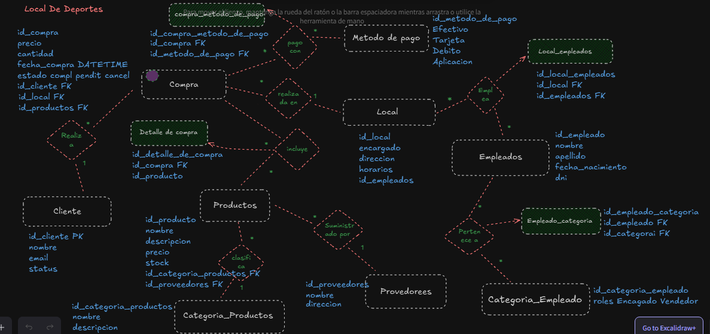
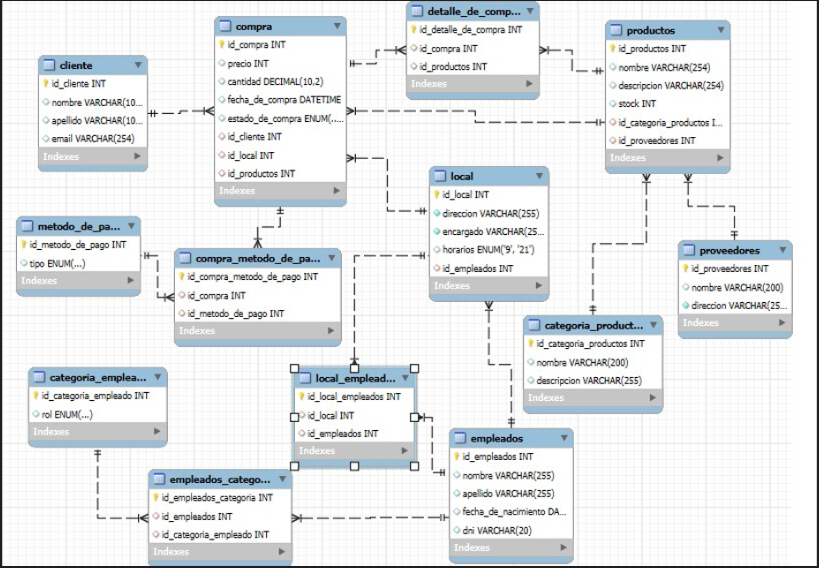

# Segunda Entrega por Edgar Steinberg 🚀

## Vistas

### `vw_ventas_empleado_local`
Muestra el total de ventas realizadas por cada empleado y por cada local. Se calcula la venta total por empleado y por local, agrupando por el ID del empleado y ordenando por las ventas del empleado.

### `vw_compras_completadas`
Muestra el total de compras completadas y las ventas totales por cada local, agrupando por local y mostrando la cantidad de compras completadas y su total de ventas.

---

## Funciones

### `fx_total_ventas_por_metodo`
Retorna el número total de ventas realizadas mediante un método de pago específico, como 'Efectivo', al contar las compras asociadas a ese método.

### `fx_total_stock_producto`
Retorna el stock total disponible para un producto específico. Si el producto no existe o no tiene stock, devuelve un mensaje indicando que no hay stock disponible.

---

## Procedimientos

### `AgregarCliente`
Inserta un nuevo cliente en la tabla `cliente` utilizando los parámetros proporcionados (nombre, apellido y email), y luego retorna los datos del cliente insertado.

### `GenerarInformeComprasYEmpleados`
Genera un informe de compras y empleados, limitando la cantidad de resultados y filtrando por estado de compra. Incluye información de la compra, el cliente, el empleado y el local.

---

## Triggers

### `trigger_bi_stock`
Valida que el stock de un producto sea mayor a 0 antes de insertarlo en la tabla `productos`. Si el stock es 0 o negativo, genera un error personalizado y evita la inserción.

### `trg_cliente_insert`
Registra una auditoría de inserciones en la tabla `cliente_auditoria` cada vez que se inserta un nuevo cliente en la tabla `cliente`, guardando la acción de inserción.

### `trg_cliente_update`
Registra una auditoría de actualizaciones en la tabla `cliente_auditoria` cada vez que se actualiza un cliente en la tabla `cliente`, guardando la acción de actualización.

### `trg_cliente_delete`
Registra una auditoría de eliminaciones en la tabla `cliente_auditoria` cada vez que se elimina un cliente de la tabla `cliente`, guardando la acción de eliminación.

## Primer DER Local de Deportes

## DER WORKBENCH

# Base de Datos: es_deportes

## Descripción General

Esta base de datos está diseñada para gestionar un negocio de deportes, proporcionando una estructura para almacenar y relacionar información sobre clientes, compras, productos, métodos de pago, empleados y locales. El objetivo es optimizar las consultas de compras, control de inventario, gestión de personal y administración de locales.

## Estructura de la Base de Datos

### Tablas Principales

#### `cliente`
- **Descripción**: Almacena información básica del cliente.
- **Campos**:
  - `id_cliente`: INT (Clave primaria, autoincremental)
  - `nombre`: VARCHAR(100)
  - `apellido`: VARCHAR(100)
  - `email`: VARCHAR(254) (Único)
- **Relaciones**: Relacionada con la tabla `compra` mediante `id_cliente`.

#### `compra`
- **Descripción**: Registra cada transacción realizada.
- **Campos**:
  - `id_compra`: INT (Clave primaria, autoincremental)
  - `precio`: INT
  - `cantidad`: DECIMAL(10, 2)
  - `fecha_de_compra`: DATETIME (Fecha de la compra, valor predeterminado: `NOW()`)
  - `estado_de_compra`: ENUM('Pendiente', 'Completada', 'Cancelada')
  - `id_cliente`: INT (Clave foránea a `cliente`)
  - `id_local`: INT (Clave foránea a `local`)
  - `id_productos`: INT (Clave foránea a `productos`)
- **Relaciones**: Relacionada con `cliente`, `local`, `productos` y `compra_metodo_de_pago`.

#### `productos`
- **Descripción**: Contiene la información de cada producto en venta.
- **Campos**:
  - `id_productos`: INT (Clave primaria, autoincremental)
  - `nombre`: VARCHAR(254)
  - `descripcion`: VARCHAR(254)
  - `stock`: INT
  - `id_categoria_productos`: INT (Clave foránea a `categoria_productos`)
  - `id_proveedores`: INT (Clave foránea a `proveedores`)
- **Relaciones**: Relacionada con `categoria_productos` y `proveedores`.

#### `metodo_de_pago`
- **Descripción**: Define los métodos de pago permitidos.
- **Campos**:
  - `id_metodo_de_pago`: INT (Clave primaria, autoincremental)
  - `tipo`: ENUM('Efectivo', 'Tarjeta', 'Aplicación')

#### `local`
- **Descripción**: Almacena información de los locales donde se realizan las ventas.
- **Campos**:
  - `id_local`: INT (Clave primaria, autoincremental)
  - `direccion`: VARCHAR(255) (Único y obligatorio)
  - `encargado`: VARCHAR(255)
  - `horarios`: ENUM ('9', '21')
  - `id_empleados`: INT (Clave foránea a `empleados`)
- **Relaciones**: Relacionada con `empleados`.

#### `empleados`
- **Descripción**: Almacena la información básica de los empleados.
- **Campos**:
  - `id_empleados`: INT (Clave primaria, autoincremental)
  - `nombre`: VARCHAR(255)
  - `apellido`: VARCHAR(255)
  - `fecha_de_nacimiento`: DATE
  - `dni`: VARCHAR(20)
- **Relaciones**: Relacionada con `local` y `empleados_categoria`.

#### `categoria_empleado`
- **Descripción**: Define los roles o categorías de empleados.
- **Campos**:
  - `id_categoria_empleado`: INT (Clave primaria, autoincremental)
  - `rol`: ENUM('Vendedor', 'Encargado')
- **Relaciones**: Relacionada con `empleados` a través de `empleados_categoria`.

### Tablas Intermedias

#### `compra_metodo_de_pago`
- **Descripción**: Relaciona las compras con los métodos de pago utilizados.
- **Campos**:
  - `id_compra_metodo_de_pago`: INT (Clave primaria, autoincremental)
  - `id_compra`: INT (Clave foránea a `compra`)
  - `id_metodo_de_pago`: INT (Clave foránea a `metodo_de_pago`)

#### `detalle_de_compra`
- **Descripción**: Registra los detalles de productos en cada compra.
- **Campos**:
  - `id_detalle_de_compra`: INT (Clave primaria, autoincremental)
  - `id_compra`: INT (Clave foránea a `compra`)
  - `id_productos`: INT (Clave foránea a `productos`)

#### `local_empleados`
- **Descripción**: Relaciona los locales con sus empleados asignados.
- **Campos**:
  - `id_local_empleados`: INT (Clave primaria, autoincremental)
  - `id_local`: INT (Clave foránea a `local`)
  - `id_empleados`: INT (Clave foránea a `empleados`)

#### `empleados_categoria`
- **Descripción**: Relaciona los empleados con sus categorías o roles.
- **Campos**:
  - `id_empleados_categoria`: INT (Clave primaria, autoincremental)
  - `id_empleados`: INT (Clave foránea a `empleados`)
  - `id_categoria_empleado`: INT (Clave foránea a `categoria_empleado`)

## Problemática que Resuelve

El diseño de esta base de datos permite gestionar de manera eficiente:
- **Compras y Métodos de Pago**: Cada compra tiene un estado y se asocia a uno o varios métodos de pago, facilitando el registro de transacciones completas.
- **Inventario y Stock de Productos**: La relación entre `productos` y `categoria_productos` permite un control detallado y categorización del inventario.
- **Gestión de Empleados y Roles**: Las relaciones entre empleados y categorías organizan los roles y la asignación de personal en los locales.
- **Locales y Empleados**: La asignación de empleados a locales específicos ayuda en la organización de las operaciones.
- **Consultas y Reportes**: Este modelo facilita consultas y reportes sobre ventas, stock, empleados por local y métodos de pago utilizados.

Este sistema es robusto y permite llevar un control detallado sobre transacciones, personal, inventario y métodos de pago, brindando una base sólida para la administración de un local de deportes.

---

--MARKDOWN